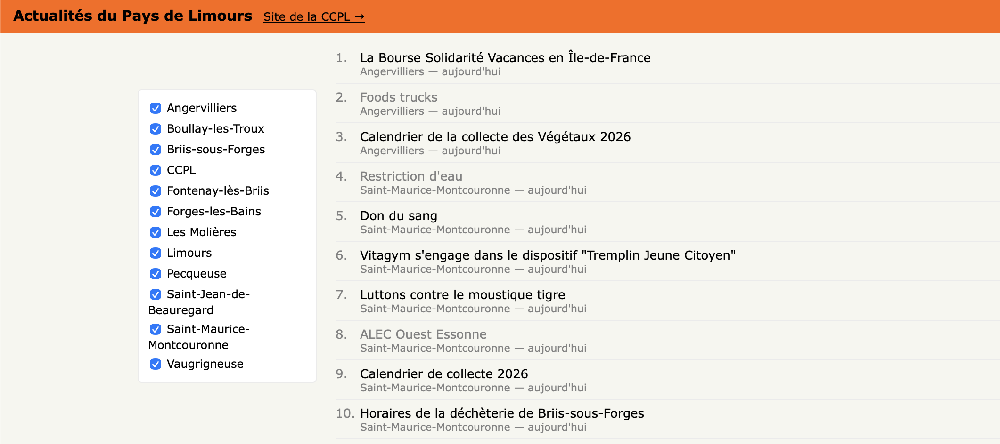

# Actualités du Pays de Limours

Agrégateur d'actualités municipales pour les communes de la **Communauté de Communes du Pays de Limours** (CCPL, Essonne) — une page unique, façon Hacker News, qui liste les dernières actualités publiées par les sites web des communes membres.

## Pourquoi

Suivre les actualités de 14 communes voisines nécessitait de visiter chaque site municipal séparément. Cette page les rassemble en une seule vue, triée par date, avec un filtre par commune.

## Fonctionnement

- **`api/ccpl_news_cron.php`** — script PHP exécuté par une tâche planifiée (cron). Il récupère les actualités de chaque commune :
  - par flux RSS quand il existe (8 communes),
  - par scraping HTML (DOMDocument/XPath) sinon (6 communes, sélecteurs adaptés au CMS de chaque site).

  Il résout les dates manquantes, déduplique par URL, ne conserve qu'une fenêtre glissante de 30 jours, puis écrit le résultat dans `data/ccpl_news.json`.
- **`ccpl_news.html`** — page statique (JS vanilla), qui charge `data/ccpl_news.json` et affiche la liste des articles, avec un panneau permettant de filtrer par commune.

## Communes couvertes

Angervilliers, Boullay-les-Troux, Briis-sous-Forges, CCPL, Courson-Monteloup, Fontenay-lès-Briis, Forges-les-Bains, Les Molières, Limours, Pecqueuse, Saint-Jean-de-Beauregard, Saint-Maurice-Montcouronne, Vaugrigneuse.

Janvry n'a pas de page d'actualités structurée exploitable.

## Déploiement

Déployé sur `https://courson-monteloup.fr/apps/ccpl_news/ccpl_news.html`, hébergement mutualisé OVH. Le cron s'exécute côté serveur ; ce dépôt ne contient pas de données personnelles (la page n'agrège que des actualités déjà publiques sur les sites des communes).
